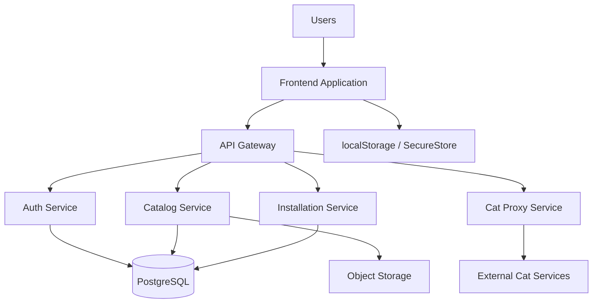

# Cat House Platform - System Architecture

**Status:** Approved | **Created:** November 30, 2025 | **Version:** 1.0

---

## Architecture Overview

Cat House uses a **completely decoupled architecture** with containerized backend services and independent frontend deployment. All communication flows through RESTful APIs with JWT authentication.

---

## High-Level Architecture



---

## Backend Architecture

### Containerized Microservices
- **Auth Service:** User authentication, JWT generation, role management
- **Catalog Service:** Cat discovery, metadata, reviews
- **Installation Service:** Instance management, permissions, credentials
- **Cat Proxy Service:** Request mediation, validation, audit

### Technology Stack
- **Language:** Python 3.11+ | **Framework:** FastAPI
- **Database:** Neon (Serverless PostgreSQL)
- **Storage:** AWS S3 | **Container:** Docker/ECS Fargate
- **API Gateway:** AWS API Gateway
- **Hosting:** AWS (us-east-1) | **Domain:** gamificator.click

---

## Frontend Architecture

### Universal Application (Web, iOS, Android)
- **Framework:** Expo + React Native (TypeScript)
- **Web Target:** Expo (web)
- **Routing:** Expo Router (file‑based, compatible con web y nativo)
- **State:** Zustand (persistencia por plataforma: SecureStore en nativo, localStorage en web)
- **UI/Design System:** Tamagui (componentes cross‑platform y theming)
- **Deployment (Web):** AWS S3 + CloudFront (export estático)
- **Distribución (Mobile):** EAS Build para iOS/Android

### Cat UI Package System
- UI packages stored locally for offline usage (web/nativo)
- Dynamic loading (lazy loading / dynamic import según plataforma)
- Sandboxed/aislamiento de UI según plataforma
- Offline support: almacenamiento persistente + cola de acciones (según plataforma)

---

## API Communication

### RESTful Endpoints
```
POST   /api/v1/auth/login
GET    /api/v1/catalog/cats
POST   /api/v1/install/{catId}
POST   /api/v1/proxy/{catId}/action
```
**Base URL:** `https://chapi.gamificator.click`

### Security
- JWT bearer tokens in `Authorization` header
- HTTPS only, proper CORS configuration
- Scoped credentials per cat installation
- Backend validates all permissions before proxying

---

**Document Owner:** Winston (Architect)